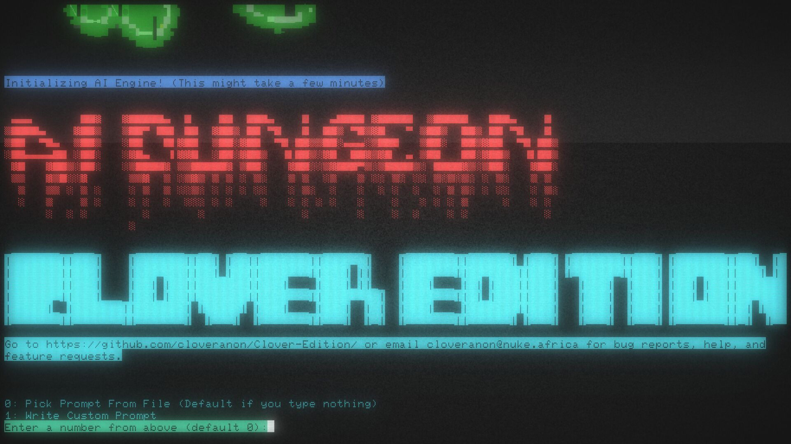
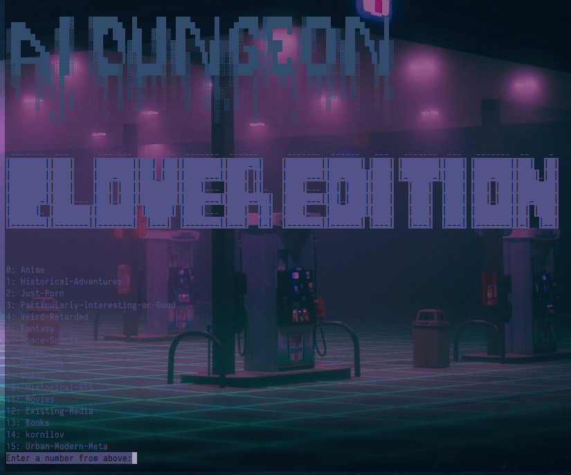
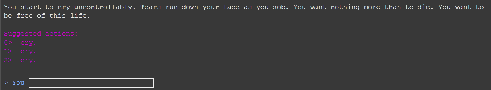

# AIDungeon2
## Clover Edition (Ollama)

A fork of AIDungeon2 with numerous improvements. Now powered by Ollama, allowing for use with a wide variety of open-source models.




Also take a look at [AIDungeonPastes](https://aidungeonpastes.github.io/AID2-Art/) for some drawn gameplay examples.

## Features

* **Ollama Backend**: Replaces the original AI model with support for any model running on an Ollama server, giving you complete control over your gameplay experience.
* **Web Terminal Interface**: Play the game directly in your browser thanks to a new web interface powered by websockets.
* **Docker Support**: Includes `Dockerfile` and `docker-compose.yml` for easy and reproducible deployment.
* **Character Sheet & Inventory**: A persistent character sheet tracks your stats and inventory. Use the `/sheet` command to view it and `/drop` to manage your items.
* **Dynamic Action Suggestions**: The suggestion system is now more intelligent, providing actions based on keywords in the story, your current inventory, and AI-generated ideas to keep the adventure moving.
* **Automatic Story Summarization**: For longer adventures, the game will automatically summarize earlier parts of your story to maintain context and improve AI performance.
* **Random Story Generation**: Don't have a prompt in mind? Let the AI generate a unique starting scenario for you!
* **Complete UI Rewrite**: Features colored text, a console bell, an improved prompt selection menu, and the ability to save custom prompts.
* **Repetition Penalty**: Helps to reduce AI looping behavior for a more dynamic story.
* **Simplified Configuration**: A simple `config.ini` file allows for easy customization of game and model settings.

## Install instructions

We encourage and recommend installing and running the game locally.

### Prerequisites

1.  **Python**: You will need Python 3 installed.
2.  **Ollama**: You must have a running Ollama instance. You can download it from [ollama.ai](https://ollama.ai). After installing, pull a model to use with the game (e.g., `ollama pull llama2`).

### Local Install

1.  Download this repo. Github has a green download button to the top right that looks like: `[⤓ Code]`. Click it, select "Download Zip", then unzip it to a folder. Or you can use the git command `git clone --depth=1 "https://github.com/cloveranon/Clover-Edition/"` if you have git installed.
2.  Open a command line or terminal and go to your Clover Edition folder.
3.  Install the required Python packages by running: `pip install -r requirements.txt`.

### Running on docker
1.  Build the image
```bash
docker build . -t aidungeon-web
```

2. Run the image
```bash
docker run -p 8080:8080 -p 8765:8765 \
  -e OLLAMA_HOST=http://host.docker.internal:11434 \
  aidungeon-web
```

## Playing

Make sure your Ollama server is running. Then, from the Clover Edition folder, run the game:

* **Standard Terminal**: `python -m aidungeon`
* **Web Interface**: `python web_terminal.py`

The web interface will be available at `http://localhost:8080`.

## Community

See that github issues page? Post any questions, requests, or problems there if you are willing to create a github account. Unless MicroAndSoft deletes us.
Otherwise see:

* **Website**: [4chan Discussion](https://boards.4chan.org/search#/aidungeon%20OR%20%22ai%20dungeon%22)
* **Email**: cloveranon@nuke.africa

## Contributing

Contributions are more than welcome. You can fork the thing and send a [pull request](https://help.github.com/articles/using-pull-requests/) from your fork.

